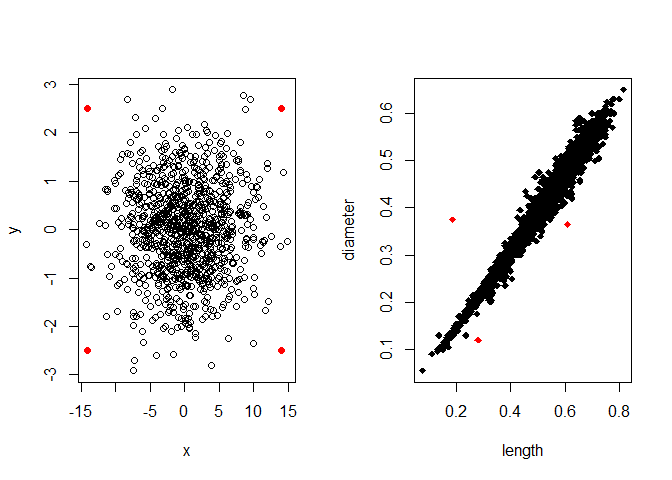
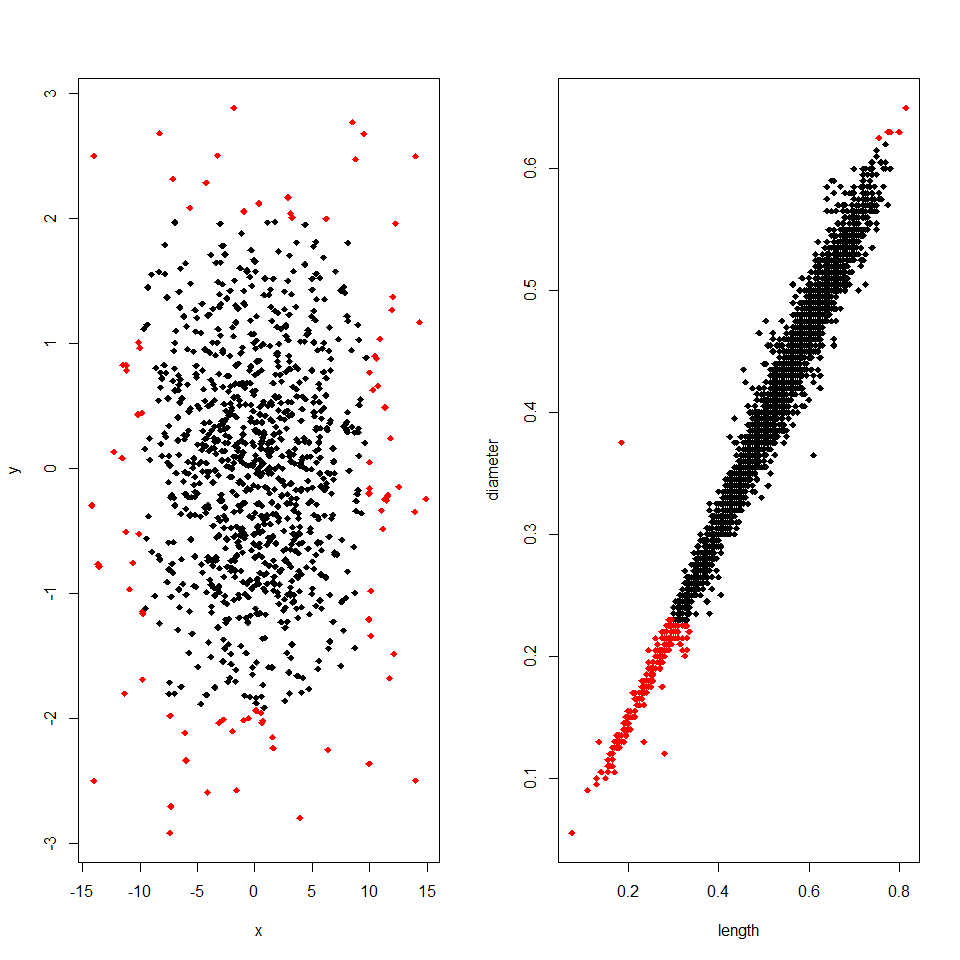
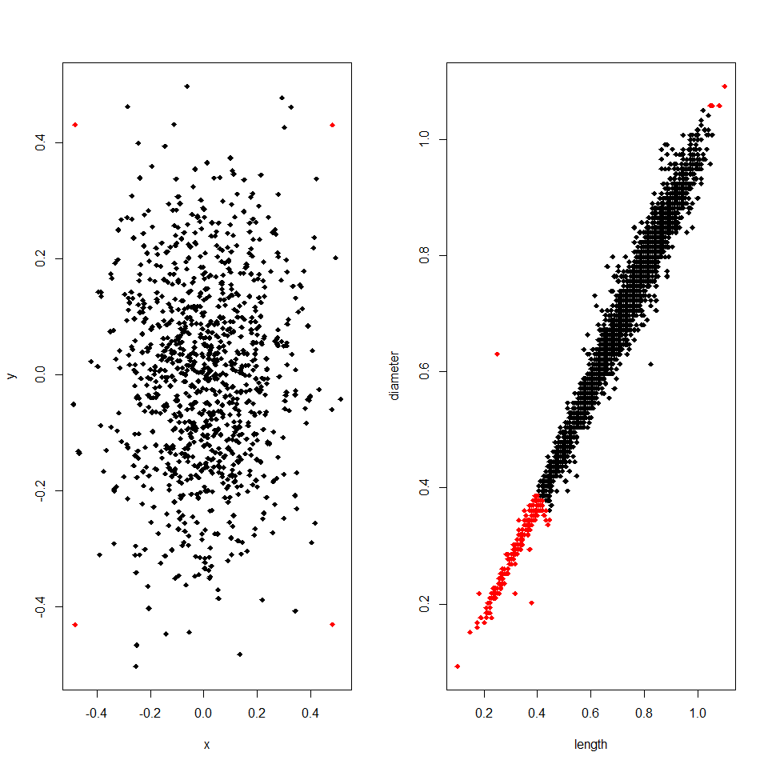
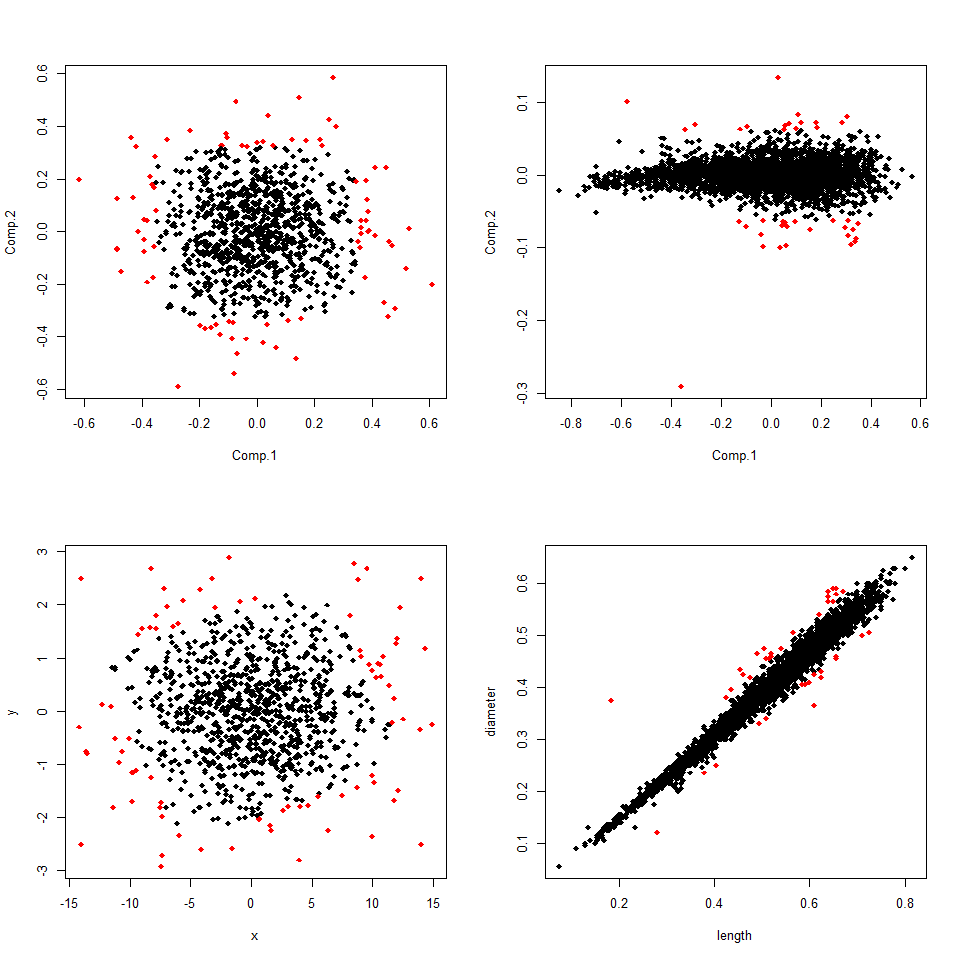
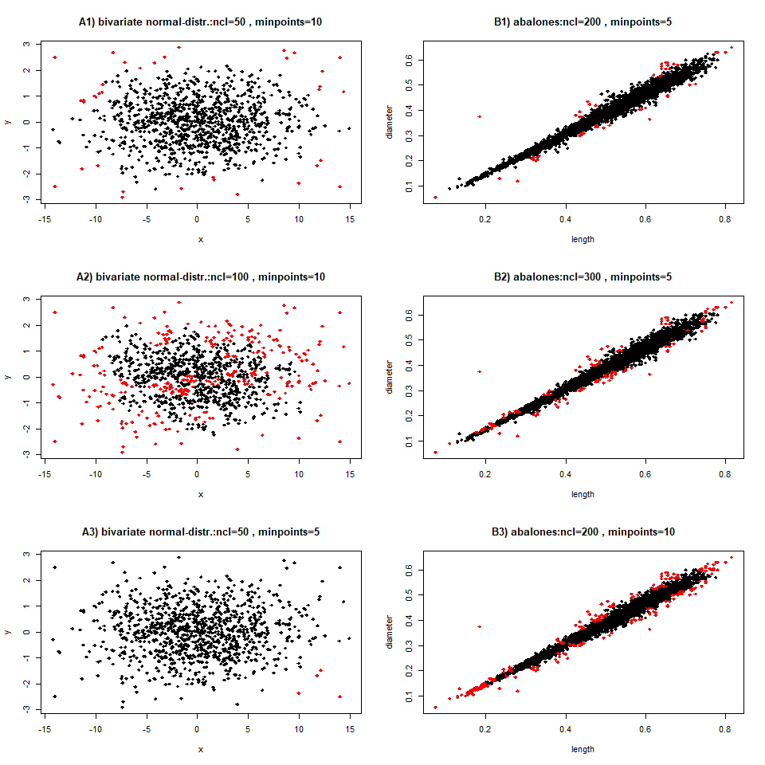
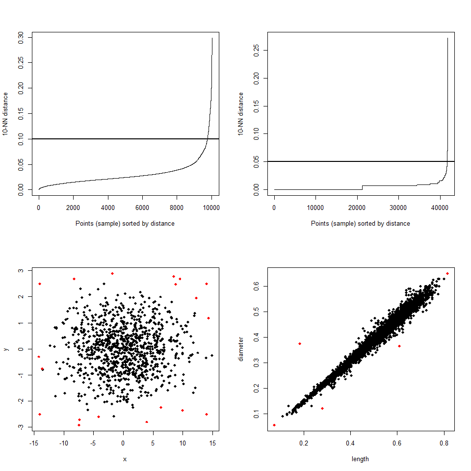

Different methods for outliers detection
================
Slim Ben Tanfous
18 octobre 2018

``` r
set.seed(41593)
##bivariate normal-distribution
x <- rnorm(1000,0,5)
y <- rnorm(1000,0,1)
par(mfrow=c(1,2))
plot(x,y)
x1 <- c(-14,-14,14,14); y1 <- c(-2.5,2.5,-2.5,2.5)
points(x1,y1,col="red",pch=19)
x <- c(x,x1); y <- c(y,y1)
data <- cbind(x,y)

abalone <- read.csv('C:\\Users\\lt32132\\Downloads\\Abalone.csv', header=TRUE, sep=",")
names(abalone) <- c("sex", "length", "diameter", "height", "weight.whole",
                    "weight.shucked", "weight.viscera", "weight.shell", "rings")
aba_out <- abalone[,2:3]
out <- which((aba_out$length<0.25 & aba_out$diameter>0.25)|
            (aba_out$length>0.6 & aba_out$diameter<0.4)|
            (aba_out$length>0.25 & aba_out$diameter<0.15))                
outliers <- rep(1,length(aba_out[,1]))
outliers[out] <- 2
plot(aba_out,col=outliers,pch=18)
```



I tested and compared diffeerent ways to detect outliers on this 2 datasets:

-   The variables length and diameter of the abalone dataset
-   The above simulated bivariate normal-distributed data

The methods are:

1.  Boxplot Method: values who differs more than 1.5 \* *I**Q**R* form the Median are possible outliers, values who differ more then 3 \* *I**Q**R* are probably outliers. *I**Q**R* is the interquartile range.
2.  Euclid Method: I estimate the euclid distances of every observation to the vector of medians. Every observations whose distances is larger than 3 times the median of the distances is an outlier.
3.  Using PCA: I apply the boxplot method separately on the two axis' of the principal component analysis
4.  Using K-Means with a huge number of clusters
5.  Using Density based clustering

**1. Boxplot Method**
=====================

I tested the two rules rules:

-   *x* is outlier : $ | x - median | &gt; 1.5 \* IQR$
-   *x* is outlier : $ | x - median | &gt; 3 \*IQR$

To apply the method I wrote two functions. bp(*X*, *f**a**c*) identifies the outliers. bp\_app(*X*, *a*) performs this function, creates the plots and prints the number of outliers:

``` r
bp <- function(X,fac){
  med <-sapply(X,median) 
  q25 <-sapply(X,function(x)quantile(x,prob=0.25)) 
  q75 <-sapply(X,function(x)quantile(x,prob=0.75)) 
  erg <- t(apply(X, 1, function(x) abs(med-x)-fac*(q75-q25)))
  return(as.vector(which(rowSums(erg>0)>0)))}

bp_app <-function(X,a){
  outliers <- rep(1,length(X[,1]))
  outliers[bp(X,a)] <- 2
  outliers<- as.factor(outliers)
  levels(outliers) <- c("No Outlier","Outlier")
  print(table(outliers))
  if(table(outliers)[2] > 0)plot(X,col=outliers,pch=18)
  return(outliers)}

#### application bivariate Normal-distribution ####
par(mfrow=c(1,2))                
print("Boxplot methode with factor 1.5 on bivariate normal-distribution")
bp1.5_1=bp_app(as.data.frame(data),1.5)
print("Boxplot methode with factor 3 on bivariate normal-distribution")
bp3_1=bp_app(as.data.frame(data),3)

### abalone Data ###
print("Boxplot methode with factor 1.5 on abalone data")                 
bp1.5_2 <-bp_app(aba_out,1.5)
print("Boxplot methode with factor 3 on abalone data")                 
bp3_2 <- bp_app(aba_out,3)
```

    ## [1] "Boxplot methode with factor 1.5 on bivariate normal-distribution"
    ## outliers
    ## No Outlier    Outlier 
    ##        916         88 
    ## [1] "Boxplot methode with factor 3 on bivariate normal-distribution"
    ## outliers
    ## No Outlier    Outlier 
    ##       1004          0 
    ## [1] "Boxplot methode with factor 1.5 on abalone data"
    ## outliers
    ## No Outlier    Outlier 
    ##       3930        247 
    ## [1] "Boxplot methode with factor 3 on abalone data"
    ## outliers
    ## No Outlier    Outlier 
    ##       4177          0



We can see that the boxplot method doesn't work on both data sets. Using the factor 1.5 many observations are identified as outsiders which aren't outsiders and shouldn't be deleted from the dataset. On the correlated data this is very obvious. With the factor 3 the method doesn' supply any outliers.

**2. Euclid Method**
====================

The problem is that the outliers are detected by horizontal or vertical boundaries. I thougt we would get better results a tleast on the uncorrelated data if the boundaries had the shape of a circular or oval. So i extended the method on the multivariate case by using the euclid metric. I estimate the euclid distances of every observation to the vector of medians. Every observations whose distance is larger than 3 times the median of the distances is an outlier:

*m**e**d* = (*m**e**d*<sub>1</sub>, ..., *m**e**d*<sub>*k*</sub>)′ is the vector of the medians of the *x*<sub>*i**j*</sub>. $i=1,...,n $ is the number of the observation and *j* = 1, ..., *k* the number of the variables.

*d*<sub>*i*</sub> is the euclid distance of *x*<sub>*i*</sub> = (*x*<sub>*i*1</sub>, ..,*x*<sub>*i**k*</sub>)′ to *m**e**d*:

$$ d\_i = \\sqrt{ \\sum\_{j=1}^{k} (x\_{ij} - med\_j)^2 }$$
 *d* is the corresponding distance of *x* and *m**e**d*<sub>*d**i**s**t*</sub> is the median of the *d*<sub>*i*</sub>, *i* = 1, ..., *n*.

We can classify outliers by the rule \* *x* is outlier :
*d* &gt; 3 \* *m**e**d*<sub>*d**i**s**t*</sub>

Like for the boxplot method I use the two functions euclid(*X*, *f**a**c*) and euclid\_app(*X*, *a*).

To force the method to use every variable equally, I standardize the variables by using $ x= $.

``` r
euclid <- function(X,fac){
  med <-sapply(X,median) 
  erg <- t(apply(X, 1, function(x) (med-x)^2))
  dist <- sqrt(rowSums(erg))
  #   print(plot(dist))
  return(dist > fac*median(dist))}

euclid_app <-function(X,a){
  outliers <- rep(1,length(X[,1]))
  outliers[euclid(X,a)] <- 2
  outliers<- as.factor(outliers)
  levels(outliers) <- c("No Outlier","Outlier")
  print(table(outliers))
  if(table(outliers)[2] > 0)plot(X,col=outliers,pch=18)
  #return(outliers)
}

#### application on bivariate Normal-Distribution ####
print("Euclid methode on bivariate normal_distribution")                 
par(mfrow=c(1,2))
data_std <- apply(data,2,function(x)x/(max(x)-min(x)))
euclid_app(as.data.frame(data_std),3)

### abalone ###
                  
aba_std <- apply(aba_out,2,function(x)x/(max(x)-min(x)))
print("Euclid methode on abalone data")   
euclid_app(as.data.frame(aba_std),3)
```

    ## [1] "Euclid methode on bivariate normal_distribution"
    ## outliers
    ## No Outlier    Outlier 
    ##       1000          4 
    ## [1] "Euclid methode on abalone data"
    ## outliers
    ## No Outlier    Outlier 
    ##       3931        246



On the simulated data set this method works really good. The four constructed points in the corners are classified as outliers but all other observations aren't outliers. Unfortunately, on the correlated abalone data the method is similar bad as the boxplot method.

**3. Outlier detection using PCA **
===================================

My next idea was to apply a Principle Component Analysis (PCA) and search on the first two Principle Components for outliers using the boxplot method. The first principle component is the linear combination of the variable with the highest variation. Thus, on this direction it should be easier to to detect outliers. If the data set had more then 2 variables, I would use as many principle components as is needed to retain 90% of the variation. I used the bp\_app-function from above to apply this method. The first plots show the values of the principle components and the ones below these of the original variables.

``` r
#### bivariate normal-distribution ####
par(mfcol=c(2,2))
print("Outlier detection using PCA with Factor 1.5 on bivariate normal-distribution")                 

PCA1.5_1 <-bp_app(as.data.frame(princomp(data_std)$scores)[,1:2],1.5)
plot(data,col=PCA1.5_1,pch=18)
print("Outlier detection using PCA with Factor 3 on bivariate normal-distribution")                 
PCA3_1 <-bp_app(as.data.frame(princomp(data_std)$scores)[,1:2],3)

### abalone ###
print("Outlier detection using PCA with Factor 3 on abalones data")                 
PCA3_2 <- bp_app(as.data.frame(princomp(aba_std)$scores)[,1:2],3)
plot(aba_out,col=PCA3_2,pch=18)
```

    ## [1] "Outlier detection using PCA with Factor 1.5 on bivariate normal-distribution"
    ## outliers
    ## No Outlier    Outlier 
    ##        919         85 
    ## [1] "Outlier detection using PCA with Factor 3 on bivariate normal-distribution"
    ## outliers
    ## No Outlier    Outlier 
    ##       1004          0 
    ## [1] "Outlier detection using PCA with Factor 3 on abalones data"
    ## outliers
    ## No Outlier    Outlier 
    ##       4136         41



On the simulated bivariate normaldistributed data the boxplot method using the factor 3 doesn't identifies any outliers in the principle components and with the factor 1.5 again are too many observation classified as outliers. On the variables length and diameter of the abalones dataset this method works better than the previous ones. The three obvious outliers paralel to the points-band are detected but the outliers on the bottom-left corner isn't. Furthermore, many points are identified as outliers which are pretty close to the points-band. On the plot of the principle components we can see that only on the second principle component outliers are found.

**4. Outlier detection using K-Means**
======================================

Another method, which I read about, is to use the k-Means Algorithmus with a huge number of clusters. Observations in small clusters are outliers.

Unfortunately, the methods has two drawbacks. First we need to use the right values for two parameters: The number of Clusters (nCl) and minpoints. If in a Clusters are less then minpoints observations the observations in the cluster are handled as outliers. I don't know a rule how to estimate this parameter properly. So I tried several values and show here the best, which I found, as well as two others, were the method didn't detect outliers satisfiing. The second disadvantage is that k-Means at the start chooses representatives of the clusters randomly. Thus, the created clusters as well as the detected outliers can differ by chance. I used the standardized data.

``` r
#### bivariate Normal-Distribution ####
par(mfcol= c(3,2))
cl1_1 <- kmeans(data_std,50)
ind <- as.vector(which(table(cl1_1$cluster)< 10))
out <- ifelse(cl1_1$cluster %in% ind,2,1)
plot(as.data.frame(data),pch=18,col=out, main="A1) bivariate normal-distr.:ncl=50 , minpoints=10")

cl2_1 <- kmeans(data_std,100)
ind <- as.vector(which(table(cl2_1$cluster)< 10))
out <- ifelse(cl2_1$cluster %in% ind,2,1)
plot(as.data.frame(data),pch=18,col=out, main="A2) bivariate normal-distr.:ncl=100 , minpoints=10")

cl3_1 <- kmeans(data_std,50)
ind <- as.vector(which(table(cl3_1$cluster)< 5))
out <- ifelse(cl3_1$cluster %in% ind,2,1)
plot(as.data.frame(data),pch=18,col=out, main="A3) bivariate normal-distr.:ncl=50 , minpoints=5")

### abalone ###
cl1_2 <- kmeans(aba_std,200)
ind <- as.vector(which(table(cl1_2$cluster)< 5))
out <- ifelse(cl1_2$cluster %in% ind,2,1)
plot(as.data.frame(aba_out),pch=18,col=out, main="B1) abalones:ncl=200 , minpoints=5")

cl3_2 <- kmeans(aba_std,300)
ind <- as.vector(which(table(cl3_2$cluster)< 5))
out <- ifelse(cl3_2$cluster %in% ind,2,1)
plot(as.data.frame(aba_out),pch=18,col=out, main="B2) abalones:ncl=300 , minpoints=5")

cl2_2 <- kmeans(aba_std,200)
ind <- as.vector(which(table(cl2_2$cluster)< 10))
out <- ifelse(cl2_2$cluster %in% ind,2,1)
plot(as.data.frame(aba_out),pch=18,col=out, main="B3) abalones:ncl=200 , minpoints=10")
```



Plot *A*1 shows that the method can work quite well. The four constructed points are detected as well as some points who lie a bit apart of the points cloud. But *A*2 shows that if we use too many clusters, points which are pretty central can get classified as outliers. For Plot *A*3 I lowered minpoints from 10 to 5. The result is that just 4 points are identified as outliers. In dead this points are outliers but not the four most extreme. This shows that this method relies on chance. On the abalone data I got a satisfying results with none of the tested parameter. In *B*1 one clear outlier (length around 0.6, diameter around 0.4 is missed but many other points on the points-band are rated as outliers. In the other two plots even more points which we wouldn't want to dismiss are classified as outliers. So based on my results k-Means doesn't deliver a confidently outlier detection. The identified candidates need to be evaluated closely.

**5. Outlier detection using density-based Clustering**
=======================================================

The last method I wanted to test is the density-based clustering. This method classifies observations as outliers if there are too few observations in their surrounding. The parameter eps gives the radius of this neighborhood around the point. In this *ϵ*-neighborhood other observations are searched . If their number is at least minPts the point is a *core point*. If a points isn't a *core point* but lies in the *ϵ*-neighborhood of a *core point* the point is a *border point*. Every observation that neither is a *core point* nor a *border point* is an outlier.

Thus, to perform the density-based clustering we need to set this two parameter. Fortunately, there is an standardisized method to determine the optimal eps- value. The idea is to calculate, the average of the distances of every point to its *k* nearest neighbors. The value of *k* needs to be set and corresponds to MinPts. Next, these *k*-distances are plotted in an ascending order. The aim is to determine the elbow, which corresponds to the optimal eps parameter. As I dont want to create the best clusters but to detect clear outliers I choose a value sleightly above of the elbow as eps.

I tried MinPts = 10 and was very much satified by the results. Again I used the standardized data:

``` r
#### bivariate Normal-Distribution ####

library("dbscan")
```

    ## Warning: package 'dbscan' was built under R version 3.5.3

``` r
par(mfcol=c(2,2))
kNNdistplot(data_std, k =  10)
abline(h=0.1,lwd=2)
dbcl1_1<-dbscan(data_std,eps=0.1,minPts=10)
plot(as.data.frame(data),pch=18,col=ifelse(dbcl1_1$cluster==0,2,1))

### abalone ###
kNNdistplot(aba_std, k =  10)
abline(h=0.05,lwd=2)
dbcl1_2 <- dbscan(aba_std,eps=0.05,minPts=10)
plot(as.data.frame(aba_out),pch=18,col=ifelse(dbcl1_2$cluster==0,2,1))
```



On the simulated data the method caught the four constructed outliers as well as some other points. By inspecting the plot we can confirm that all these points are outliers. No point in the middle of the points-cloud are wrongly rated as outlier. Maybe a few more points could have been classified as outliers like the ones around (*x* = 15, *y* = 0) but overall I am quite satisfied with the result.

On the abalones data only the five clear oultiers are detected.

**Summary**
===========

The clear winner is the density-based clustering. This method is the only one, which works well on both data sets.

The Euclid method identifies only the four constructed points as outliers in the simulated data. Thus it works quite well to detect only huge outliers in uncorrrelated data. But on the correlated data it classifies points as outliers which are quite central. So this method is only useful in special cases.

The results of the outlier detection using k-Means is based on chance and also the parameter needs to be set correctly. So this method isn't confidently. Also on the correlated data even in the best results many observation were classified as outliers which are pretty close to the points-band.

The boxplot method and the outlier detection using the PCA doesn't supplies satisfying results on the tested datasets.
